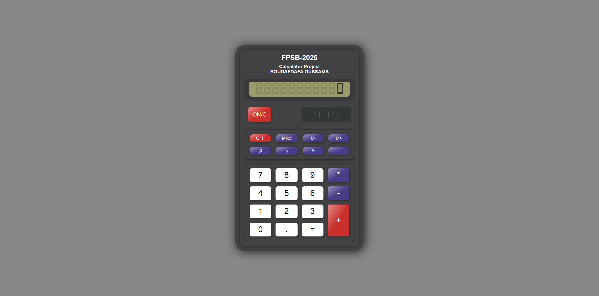

# Classic Calculator

A simple web-based calculator inspired by the classic ones we all used in school. Built with HTML, CSS, and JavaScript.

## ✨ Features

- Basic arithmetic operations: addition, subtraction, multiplication, division
- Memory functions: M+, M-, MRC
- Square root, percentage
- Sound on/off toggle
- Clean and nostalgic UI design

## 💻 Technologies

- HTML5
- CSS3
- JavaScript

## 📷 Preview

---

Made with curiosity  
By **BOUDAFDAFA OUSSAMA**
